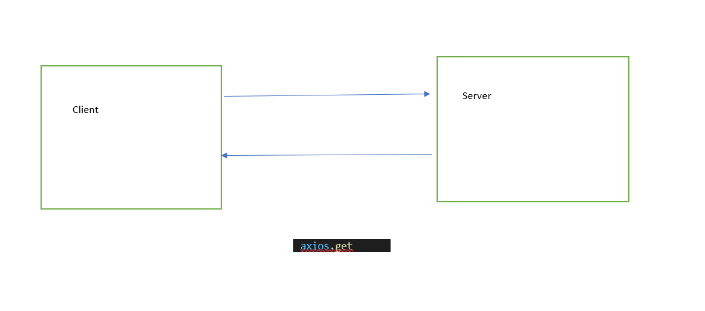

# city-explorer-api
Backend-Custom Servers with Node and Express

**Author**: Razan Armouti
**Version**: 1.0.0 (increment the patch/fix version number if you make more commits past your first submission)

## Overview
<!-- Provide a high level overview of what this application is and why you are building it, beyond the fact that it's an assignment for this class. (i.e. What's your problem domain?) -->
this is the backend of city-explorer- server side 

## Getting Started
<!-- What are the steps that a user must take in order to build this app on their own machine and get it running? -->
firstly the user go to the frontend and insert the city and press in the explorer button.
the backend app provide the for the description and the date.

## Architecture
<!-- Provide a detailed description of the application design. What technologies (languages, libraries, etc) you're using, and any other relevant design information. -->
the query parameters should be send within the frontend application 

## Change Log
<!-- Use this area to document the iterative changes made to your application as each feature is successfully implemented. Use time stamps. Here's an example:

01-01-2001 4:59pm - Application now has a fully-functional express server, with a GET route for the location resource. -->
14-09-2021 2:22am - Application now has a fully-functional express server, with a GET route for the location resource

## Credit and Collaborations
<!-- Give credit (and a link) to other people or resources that helped you build this application. -->
[Live URL](https://city-explorer-api-lab.netlify.app/)

### Feature #1: Custom Servers with Node and Express
* Number and name of feature: Feature #1: Custom Servers with Node and Express
* Estimate of time needed to complete: 5:00

* Start time: 6pm

* Finish time: 2:30am

* Actual time needed to complete:10 hours

# Data flow
